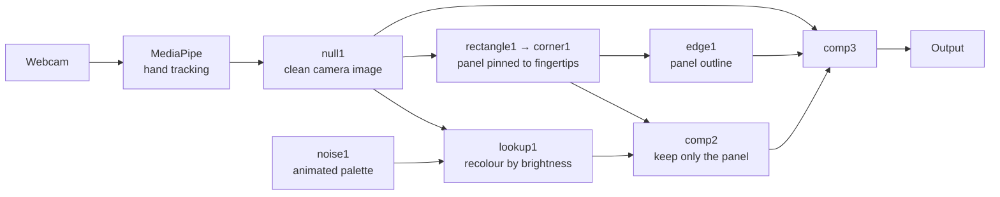

# Hand-Held Noise Portal

A real-time video filter built in TouchDesigner. I was jus You hold up both hands, and the
rectangle stretched between your fingertips becomes a portal. Inside it, the
camera image is repainted in colours pulled from a slowly drifting cloud of
noise, so it looks like the picture has been dipped in oil-slick paint that
never stops moving. Outside the rectangle, the video is exactly what the camera
sees.

<!-- Add a GIF or screenshot here -->

---

## What you are looking at

Two things are happening at once.

**Your hands define a panel.** Hand tracking finds the tip of each thumb and
each index finger. Those four points become the four corners of a
quadrilateral, so the panel stretches, skews and rotates as you move. The
effect appears only inside it, with a thin outline so you can see where the
edge is.

**The image is recoloured by a lookup.** Every pixel inside the panel is
replaced by a colour chosen by its brightness: dark pixels take the colour at
one end of a strip, bright pixels the colour at the other end, everything else
somewhere in between. The strip itself is cut out of a noise image that is
animating, which is why the palette never settles. Nothing is being drawn on
top of you; your own light and shadow are still there, just wearing different
colours every frame.

## New to TouchDesigner?

TouchDesigner is a visual programming environment for real-time graphics.
Instead of writing a program from top to bottom, you place **operators**
(nodes) on a canvas and wire them together. Data flows left to right through
the wires, and every node recalculates 60 times a second.

Nodes are grouped by the kind of data they carry. The two that matter here are
**TOPs**, which pass images around on the graphics card, and **CHOPs**, which
pass streams of numbers, such as where a fingertip is right now. A **COMP** is
a container that holds a whole sub-network and can be reused like a function.

You do not need to know any of this to run the project. It just explains why
the file is a node graph rather than a folder of source code.

## How it works



The camera feed goes two ways. One branch draws the panel: a white rectangle
is corner-pinned to the four tracked fingertips, giving a solid shape that
marks where the effect belongs. The other branch runs the **whole frame**
through the lookup. `comp2` then multiplies the recoloured frame by the panel
shape so everything outside it falls away, and `comp3` lays that over the
untouched camera, with the outline on top.

The order matters more than it looks. The filter has to run on the complete
image and be masked **afterwards**. If you mask first, the lookup sees a flat
black region outside the panel and cheerfully paints it a solid colour, and
that colour changes every frame with the noise. It took a while to work out
why the outside was flashing.

### Inside the filter

```
null1 (camera) ───────────► lookup1 input 1   (the image being recoloured)
noise1 (animated noise) ──► lookup1 input 2   (the strip of colours to pick from)
```

The Lookup TOP reads a line across its second input, from black to white, and
uses it as a colour strip. Feed it a static gradient and you get a fixed
palette. Feed it noise whose **Translate Z** is tied to the clock, and the
strip is cut from a different slice of the noise every frame, so the palette
drifts continuously. That single expression, `absTime.seconds`, is the entire
animation.

### The panel

`rectangle1` draws a white rectangle at the camera's resolution. `corner1` is
a Corner Pin TOP whose four pin positions are expressions reading the tracked
hands, so the rectangle is dragged into whatever shape your fingertips make:

| Corner | Reads |
|---|---|
| Bottom left | `h1` thumb tip |
| Bottom right | `h2` thumb tip |
| Top left | `h1` index finger tip |
| Top right | `h2` index finger tip |

`h1` and `h2` are Select CHOPs that pull just the thumb and index channels for
each hand out of MediaPipe's `hand_tracking` component.

## The filter

The recolouring is only two nodes, `lookup1` and `noise1`, and it has not been
packaged as a reusable `.tox` yet (see Future improvements). The parts worth
copying into another project are those two nodes plus the `comp2`/`comp3`
masking pair.

## Parameters

On `noise1` (the palette):

| Parameter | Value | Meaning |
|---|---|---|
| **Period** | 0.7 | Size of the noise blobs. Smaller means more colours across the strip. |
| **Harmonic Spread** | 1.3 | How much finer detail is layered on top. |
| **Harmonic Gain** | 0.61 | How strong that finer detail is. |
| **Amplitude** | 0.51 | Contrast of the noise, so how far apart the colours are. |
| **Translate Z** | `absTime.seconds` | The animation. Multiply it (`absTime.seconds * 0.3`) to slow the drift down. |
| **Monochrome** | off | Keep it off. On, the palette collapses to shades of grey. |

On `lookup1`, everything is at its defaults. If the inside of the panel ever
looks see-through, set the Channel Mask on its Common page to R, G, B only so
the lookup leaves the alpha channel alone.

On `rectangle1`: Size 1 × 0.9, Combine Input set to **Resolution** so the
rectangle is the same size as the camera image.

On the `MediaPipe` component: hand detection on, everything else off,
resolution 1280 × 720, Horizontal Flip on (so the image is a mirror), hand
detection, presence and tracking confidence all 0.2. Low confidence means
fewer moments where the panel vanishes, at the cost of a little jitter.

## Getting started

**Requires** TouchDesigner (2025.30000 or newer), a webcam, and a GPU that
supports Vulkan.

1. Open `handtracking_filter.toe`. It is about 180 MB because the MediaPipe
   component is stored inside it, so give it a minute. MediaPipe starts its
   own small browser process and opens the camera itself.
2. Allow camera access when prompted.
3. Hold both hands up, palms toward the camera, thumbs and index fingers
   extended.
4. The panel appears stretched between your fingertips. `comp3` is the
   finished picture. Press F1 for Perform mode, Esc to come back.

If nothing appears in the panel, check that no other app has the camera open.
MediaPipe will not share it, and a second reader either gets nothing or
drags the frame rate down.

**About the file size.** GitHub refuses files over 100 MB. If you want to push
this project, either track the `.toe` with [Git LFS](https://git-lfs.com/), or
select the `MediaPipe` component, turn **Enable External .tox** back on, and
point it at `../mediapipe/toxes/MediaPipe.tox`. The project then saves at
around 20 KB and loads the component from that file instead.

## Challenges and what I learned

**Masking before the filter produced flashing colours.** The first version
combined the panel with the video, then ran the lookup. Outside the panel the
lookup received flat black, mapped it to whatever colour sat at the dark end of
the noise strip, and that end changed every frame. Worse, the Lookup TOP maps
alpha through the strip too, so the outside came out fully opaque and no
Composite afterwards could let the camera through; every attempt showed up as
a tint. Running the filter on the whole frame and masking afterwards fixed it
in one move. Lesson: a filter that recolours black cannot be given black to
recolour.

**Transparency is multiplied, not just flagged.** `comp2` is a Multiply, not
an Over. TouchDesigner composites premultiplied, so a pixel with colour but
zero alpha still adds its colour to whatever is underneath. Multiplying by the
panel zeroes colour and alpha together, which is what "premultiplied" means.

**Moving the project folder silently broke it.** The MediaPipe component was
referenced as an external `.tox` by a path relative to the project file, and
that path pointed at a Downloads folder that no longer existed. After the
`.toe` moved into this folder it could not have loaded either way. TouchDesigner
resolves external files relative to the `.toe`, so moving the file means
moving the references. Embedding the component is the blunt fix and the reason
the file is 180 MB.

**The camera will not share.** MediaPipe opens the webcam in its own process.
A Video Device In TOP alongside it either errors and retries every frame,
which drops TouchDesigner below 10 fps, or sits on "Initializing" forever.
Whoever opens the camera first wins. Everything in this project takes the
image from `MediaPipe/video` for that reason.

**`.toe` files are binary.** They can be unpacked into readable text with
`toeexpand.exe`, which ships in TouchDesigner's `bin` folder. That is how the
wiring above was checked rather than remembered.

## Future improvements

- **Package the filter as a `.tox`** with Period, Speed and Contrast on the
  front, so it can be dropped into any project.
- **Look into the past.** Swap the lookup for a Texture 3D TOP feeding a Time
  Machine TOP, so the panel shows the camera a few seconds ago, with how far
  apart your hands are setting how far back you look.
- **Let the panel paint.** A Feedback TOP on the mask so wherever the panel
  has been stays converted and slowly fades.
- **Gesture control.** Pinch to freeze the palette; hand distance driving the
  noise Period.
- **Slim the repository** by re-linking MediaPipe as an external `.tox`
  (see Getting started).
- `comp1` and `null2` are leftovers from the first version and are not
  connected to anything; they can be deleted.

## References

- **[MediaPipe TouchDesigner](https://github.com/torinmb/mediapipe-touchdesigner)** — Torin Blankensmith. Brings Google's MediaPipe hand landmark tracking into TouchDesigner.
- **[MediaPipe Hand Landmarker](https://ai.google.dev/edge/mediapipe/solutions/vision/hand_landmarker)** — Google. Documentation for the 21-point hand model.
- **[TouchDesigner documentation](https://docs.derivative.ca/)** — Derivative. Particularly the [Lookup TOP](https://docs.derivative.ca/Lookup_TOP), [Composite TOP](https://docs.derivative.ca/Composite_TOP) and [Corner Pin TOP](https://docs.derivative.ca/Corner_Pin_TOP) pages.

## Credits

Hand tracking by [Torin Blankensmith](https://github.com/torinmb/mediapipe-touchdesigner)
and Google MediaPipe. Panel rig, lookup filter and compositing by the author of
this repository.
